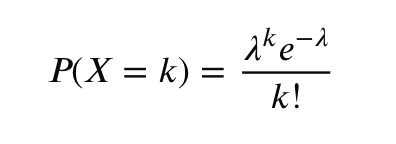

# Poisson Distribution
A Poisson distribution is a discrete probability distribution that expresses the probability of a given number of events occurring within a fixed interval of time or space. It is used when events happen independently at a known, constant average rate.

# Core Concept
Named after French mathematician Siméon Denis Poisson, it answers questions like, "If a call center receives an average of 5 calls per hour, what are the odds of receiving exactly 8 calls in the next hour?".

# Real-World Examples
- Time: 
  - The number of emails received in a day, or customers arriving at a store between 1:00 PM and 2:00 PM.
- Space: 
  - The number of typographical errors per page in a book, or potholes in a mile of road.
- Quality Control: 
  - The number of defective items produced in a manufacturing batch.

# Key Rules and Assumptions
To use a Poisson distribution, the following conditions must be met:
1. **Independence**: The occurrence of one event does not affect the probability of another event occurring.
2. **Constant Rate**: The average rate at which events occur must be steady and unchanging during the interval.
3. **No Simultaneous Occurrences**: Events must occur one at a time (e.g., two people cannot arrive at the exact same sub-microscopic moment in time).

# The Formula
The probability of getting exactly `k` events is calculated using the formula:

Where:
- `P(X = k)` = The probability of exactly `k` events occurring.
- `λ` (Lambda) = The average number of events per interval.
- `e` = Euler's number, a mathematical constant approximately equal to **2.71828**.
- `k` = The number of events you want to find the probability for.
- `k!` = The factorial of `k` (e.g., `3! = 3 * 2 * 1 = 6`).

# Mean and Variance
A unique characteristic of the Poisson distribution is that its mean (average) and variance are exactly equal to `λ`.

- Mean = `λ`
- Variance = `λ`
- 
Because of this, if the average number of events is known, you instantly know both the expectation and how spread out the possible results are.

